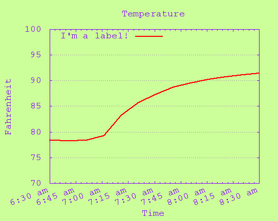

timelineplot
============

Timelineplot generates simple line plots from two columns of character-delimited data. The first column represents the time variable (x-axis) and the second column contains the values to be plotted.

Timelineplot is a wrapper for gnuplot with many options in the plot script adjustable by optional command line arguments.


## Usage
```
  timelineplot <datafile> <imagefile> [options]
```

When the data file is `-`, data is read from standard input.

The most immediately useful command line options are `-sep` and `-tfmt` which set the column separator and time format used in the input data file.

For adjusting output, the `-h`, `-w`, and `-xfmt` options set the image height, width, and the format string for x-axis tic labels.

See the [manual](doc/manual.txt) for the full list of options.

### Examples

A very basic example without any of the optional arguments:

```bash
timelineplot jan1-2.txt 1.png
```
(Also equivalent would be `timelineplot - 1.png < jan1-2.txt` and `cat jan1-2.txt | timelineplot - 1.png`.)


Use a time formatter for the x-axis tic labels and make it wider:

```bash
timelineplot jan1-2.txt 2.png -xfmt "%l %p" -w 600
```


Use just about all the options at once:

```bash
timelineplot jan1-2.txt 3.png -h 432 -w 543 -xfmt "%l:%M %p" -title "Temperature" -linetitle "I'm a label!" -xlabel "Time" -ylabel "Fahrenheit" -ymin 70 -ymax 100 -xmin "2019-01-01 06:30:00" -xmax "2019-01-01 08:30:00" -xrot 20 -lc "red" -bgcolor "#ccff99" -grid ytics -font "courier" -fontsize 14 -fontcolor "#8800ff"
```




## Dependencies

* gnuplot


## Installation

```bash
make
sudo make install
```
