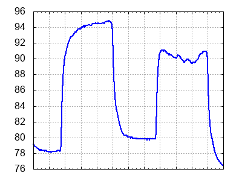
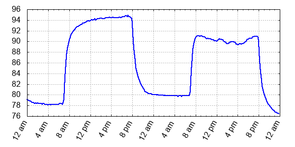

timelineplot
============

Timelineplot generates simple line plots from two columns of character-delimited data. The first column represents the time variable (x-axis) and the second column contains the values to be plotted.

Timelineplot is a wrapper for gnuplot with many options in the plot script adjustable by optional command line arguments.


## Usage
```
  timelineplot <datafile> <imagefile> [options]
```

When the data file is `-`, data is read from standard input.

The most immediately useful command line options are `-sep` and `-tfmt` which set the column separator and time format used in the input data file.

For adjusting output, the `-h`, `-w`, and `-xfmt` options set the image height, width, and the format string for x-axis tic labels.

See the [manual](doc/manual.txt) for the full list of options.

### Examples

```bash
timelineplot jan1-2.txt 1.png
```




```bash
timelineplot jan1-2.txt 2.png -xfmt "%l %p" -w 600
```




## Dependencies

* gnuplot


## Installation

```bash
make
sudo make install
```
